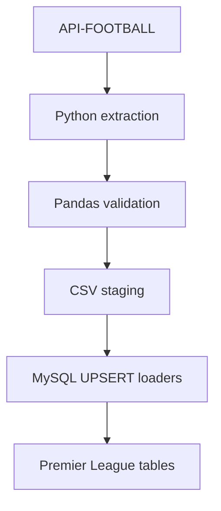

# Pipeline Architecture

*Last reviewed: 2026-08-21*

## Scope

This pipeline processes data for the 2024 Premier League season only.

It extracts:

* 380 fixtures
* 20 teams
* 20 venues

International matches, synthetic match data, and other leagues are outside the current project scope.

## Data Flow



## Pipeline Steps

The pipeline starts from `run_pipeline.py` and executes four Python scripts in order.

### Step 1: Extract matches

`scripts/api_matches.py` calls the API-FOOTBALL fixtures endpoint using the configured league and season.

It extracts:

* Fixture ID
* Match date
* Home team
* Away team
* Home goals
* Away goals

The transformed data is saved to:

```text
data/live_matches.csv
```

### Step 2: Extract teams and venues

`scripts/api_teams.py` calls the API-FOOTBALL teams endpoint.

It separates the response into two datasets:

```text
data/teams.csv
data/venues.csv
```

Team data includes API IDs, names, codes, country, founding year, logo, and venue ID.

Venue data includes venue IDs, names, addresses, cities, capacity, surface, and image URL.

### Step 3: Load venues and teams

`scripts/load_teams.py` validates both CSV files before writing to MySQL.

Venues load first because `teams.venue_id` references `venues.venue_id`.

Full column definitions for both tables are in the [Data Model](data-model.md). This document only covers the relationship that determines load order.

Before loading, the script verifies that every non-null venue ID referenced by a team exists in the venue dataset.

If a referenced venue is missing, `load_teams.py` raises an error such as:

```text
ValueError: Teams reference missing venues: [494]
```

The loader exits with a nonzero status, and `run_pipeline.py` stops the remaining steps. Validation happens before the database connection is opened, so no team or venue rows are written.

### Step 4: Load matches

`scripts/load_live_matches.py` validates and loads the fixture data.

The API fixture ID is used as the primary key. Existing fixtures are updated, while new fixtures are inserted.

## Database Write Order

```text
venues
   ↓
teams
   ↓
live_matches
```

Venue records load before teams because of the foreign key relationship.

The current `live_matches` table stores team names rather than team IDs, so it does not yet have foreign keys to the `teams` table.

## Staging Layer

CSV files provide a transparent staging layer between the API and MySQL.

This makes it possible to:

* Inspect extracted data before loading
* Validate record counts
* Identify missing or malformed values
* Reproduce database loads without another API request
* Compare API output between pipeline runs

### Why files instead of a staging table?

CSVs keep the staging layer simple, portable, and database-independent. Anyone can inspect or compare them without connecting to MySQL.

The tradeoff is that CSV files do not enforce schemas, support concurrent writes, or provide transactional guarantees. For this pipeline’s current size of 420 staged rows, the simplicity is worth the tradeoff.

A database staging layer or raw object storage would become more appropriate as data volume, write frequency, or the number of data sources increases.

## Validation

The pipeline checks:

* Required environment variables
* HTTP response status
* API error responses
* Expected response structure
* Required CSV columns
* Valid fixture, team, and venue IDs
* Duplicate API IDs
* Missing team names
* Missing venue relationships
* Invalid dates and numeric values

A failed validation stops the affected step.

## Idempotent Loading

The pipeline uses MySQL UPSERT operations.

This means rerunning the pipeline:

* Does not create duplicate fixtures
* Does not create duplicate teams
* Does not create duplicate venues
* Updates records when API values change

Duplicate protection is enforced through primary and unique keys.

## Transactions and Failure Handling

Each loader commits its changes only after the full batch succeeds.

If a database error occurs:

1. The transaction is rolled back.
2. The database connection is closed.
3. The error is raised.
4. `run_pipeline.py` stops the remaining pipeline steps.

This prevents partially loaded batches.

The team and venue loader handles both tables in one transaction. If either table fails, neither batch is committed.

The match loader uses a separate transaction because it runs as a separate pipeline step.

## Security

Secrets are stored in the local `.env` file, which Git ignores.

The pipeline connects with the restricted `soccer_app` account.

The application account only receives:

* `SELECT`
* `INSERT`
* `UPDATE`
* `DELETE`

Schema creation and migrations require a separate MySQL administrator account.

This prevents the pipeline from accidentally creating, dropping, or altering tables.

## Current Limitations

* Fixture records store team names instead of team foreign keys.
* The pipeline performs a full extraction on every run. It currently makes two API requests—one for 380 fixtures and one for 20 team records—and rewrites all three CSV files even when nothing changed. This uses API quota and repeats unnecessary processing, which will matter once the pipeline runs frequently on a schedule.
* Pipeline runs are logged to the console but not stored in a monitoring table.
* Retries and scheduling are not yet automated.
* Raw API JSON is not stored separately from transformed CSV data.

## Planned Improvements

* Add home and away team foreign keys to fixtures
* Add incremental fixture extraction
* Add data-quality tests
* Add pipeline run logging and freshness checks
* Add retry and rate-limit handling
* Schedule runs with Airflow
* Containerize the pipeline with Docker
* Store raw API responses in Amazon S3
* Deploy MySQL to Amazon RDS
