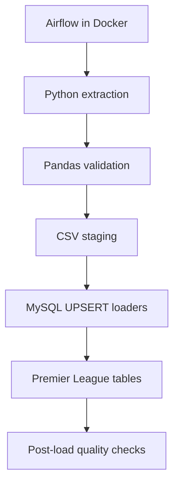

# Pipeline Architecture

*Last reviewed: 2026-10-07*

## Scope

This pipeline processes data for the 2024 Premier League season only.

It extracts:

- 380 fixtures
- 20 teams
- 20 venues

International matches, synthetic match data, and other leagues are outside the current project scope.

## Architecture


```mermaid
flowchart TD
    AIRFLOW["Airflow in Docker"] --> EXTRACT["Python extraction"]
    EXTRACT --> TRANSFORM["Pandas validation"]
    TRANSFORM --> CSV["CSV staging"]
    CSV --> LOAD["MySQL UPSERT loaders"]
    LOAD --> DB["Premier League tables"]
    DB --> QUALITY["Post-load quality checks"]
```

The project uses:

- API-FOOTBALL as the data source
- Python and Requests for extraction
- Pandas for transformation and validation
- CSV files as the staging layer
- MySQL for relational storage
- Apache Airflow for orchestration
- Docker Compose for the Airflow environment

## Pipeline Execution

The pipeline has two execution options.

### Local Python execution

Running the following command executes the pipeline directly:

```bash
python3 run_pipeline.py
```

`run_pipeline.py` calls the extraction and loading scripts in sequence.

### Airflow execution

The `premier_league_etl` DAG runs the same pipeline as five monitored tasks:

```text
extract_matches
        ↓
extract_teams_and_venues
        ↓
load_teams_and_venues
        ↓
load_matches
        ↓
validate_data_quality
```

Airflow provides task status, retries, execution history, and logs. The DAG currently uses `schedule=None`, so runs are started manually through the Airflow interface or command line.

## Pipeline Steps

### Step 1: Extract matches

`scripts/api_matches.py` calls the API-FOOTBALL fixtures endpoint using the configured league and season.

It extracts:

- Fixture ID
- Match date
- Home team
- Away team
- Home goals
- Away goals

Pandas organizes the response into rows and columns. The transformed data is saved to:

```text
data/live_matches.csv
```

### Step 2: Extract teams and venues

`scripts/api_teams.py` calls the API-FOOTBALL teams endpoint.

It separates the API response into two datasets:

```text
data/teams.csv
data/venues.csv
```

Team data includes API IDs, names, codes, country, league, founding year, logo URL, and venue ID.

Venue data includes venue IDs, names, addresses, cities, capacity, surface, and image URL.

### Step 3: Load venues and teams

`scripts/load_teams.py` validates both CSV files before writing to MySQL.

Venues load first because `teams.venue_id` references `venues.venue_id`.

Before loading, the script verifies that every non-null venue ID referenced by a team exists in the venue dataset.

If a referenced venue is missing, the loader raises an error before writing data to MySQL.

The script uses UPSERT operations so existing venues and teams are updated while new records are inserted.

### Step 4: Load matches

`scripts/load_live_matches.py` validates and loads the fixture data into the `live_matches` table.

The API fixture ID is the primary key. Existing fixtures are updated, while new fixtures are inserted.

### Step 5: Validate data quality

`scripts/validate_data_quality.py` checks the records stored in MySQL after loading finishes.

The script checks:

- Match row count equals 380
- Team row count equals 20
- Venue row count equals 20
- Fixture IDs contain no duplicates
- Fixture IDs are not missing
- Team API IDs are not missing
- Match scores are not missing
- Match scores are not negative
- Team-to-venue relationships are valid

Each check prints `PASS` or `FAIL`.

If any check fails, the script raises an error. Airflow then marks the `validate_data_quality` task and the DAG run as failed.

## Airflow Orchestration

The DAG is defined in:

```text
dags/soccer_pipeline_dag.py
```

Each Airflow task runs one Python script using `subprocess`.

The DAG uses these default settings:

- Owner: `mohamed`
- Retries: 2
- Retry delay: 5 minutes
- Catchup: disabled
- Schedule: manual

Task dependencies ensure that later tasks do not start until earlier tasks finish successfully.

A failed task prevents its downstream tasks from running. Airflow records the failure and provides logs for troubleshooting.

## Docker Environment

Docker Compose runs the Airflow environment.

The main services include:

- Airflow API server
- Airflow scheduler
- Airflow DAG processor
- Airflow worker
- Airflow triggerer
- PostgreSQL for Airflow metadata
- Redis for task communication

The custom `Dockerfile` starts from the Apache Airflow image and installs the Python packages required by the soccer pipeline.

The project directory is mounted inside the containers at:

```text
/opt/soccer
```

This allows Airflow workers to access the DAG, scripts, CSV files, and project configuration.

The soccer pipeline still loads its final data into MySQL. The PostgreSQL container belongs to Airflow and stores Airflow’s internal metadata.

## Database Write Order

```text
venues
   ↓
teams
   ↓
live_matches
   ↓
data-quality validation
```

Venue records load before teams because of the foreign-key relationship.

The current `live_matches` table stores team names rather than team IDs, so it does not yet have foreign keys to the `teams` table.

Full table definitions are documented in the [Data Model](data-model.md).

## Staging Layer

CSV files provide a visible staging layer between the API and MySQL.

This makes it possible to:

- Inspect extracted data before loading
- Validate record counts
- Identify missing or malformed values
- Reproduce database loads without another API request
- Compare API output between pipeline runs

### Why use CSV files?

CSV files keep the staging layer simple, portable, and database-independent.

The tradeoff is that CSV files do not enforce schemas, support concurrent writes, or provide transactional guarantees.

For the project’s current size of 420 staged rows, CSV files provide a simple and practical staging layer.

A database staging layer or object storage would become more appropriate as data volume, execution frequency, or the number of data sources increases.

## Validation Layers

The pipeline validates data at several stages.

### API validation

The extraction scripts check:

- Required environment variables
- HTTP response status
- API error responses
- Expected response structure

### CSV validation

The extraction and loading scripts check:

- Required columns
- Valid fixture, team, and venue IDs
- Duplicate IDs
- Missing team names
- Invalid dates
- Invalid numeric values
- Missing venue relationships

### Post-load validation

After loading finishes, `validate_data_quality.py` queries MySQL and verifies row counts, identifiers, scores, duplicates, and relationships.

A failed validation raises an error and causes the pipeline run to fail.

## Idempotent Loading

The pipeline uses MySQL UPSERT operations.

This means rerunning the pipeline:

- Does not create duplicate fixtures
- Does not create duplicate teams
- Does not create duplicate venues
- Updates records when API values change

Duplicate protection is also enforced through primary keys and unique constraints.

## Transactions and Failure Handling

Each loader commits its changes only after its full batch succeeds.

If a database error occurs:

1. The transaction is rolled back.
2. The database connection is closed.
3. The error is raised.
4. The current task fails.
5. Airflow prevents dependent tasks from running.

This prevents partially loaded batches.

The team and venue loader handles both tables in one transaction. If either table fails, neither batch is committed.

The match loader uses a separate transaction because it runs as a separate pipeline step.

When Airflow runs the pipeline, failed tasks can retry up to two times with a five-minute delay.

## Security

Secrets are stored in the local `.env` file, which Git ignores.

The pipeline connects to MySQL using the restricted `soccer_app` account.

The application account only receives:

- `SELECT`
- `INSERT`
- `UPDATE`
- `DELETE`

Schema creation and migrations require a separate MySQL administrator account.

This prevents the pipeline from accidentally creating, dropping, or altering tables.

## Current Limitations

- Fixture records store team names instead of team foreign keys.
- The pipeline performs a full extraction on every run.
- The Airflow DAG must be triggered manually because `schedule=None`.
- The row-count checks are fixed to the 2024 Premier League season.
- Pipeline runs are not stored in a separate business-monitoring table.
- Raw API JSON is not stored separately from transformed CSV data.
- The MySQL database runs outside the Airflow Docker Compose environment.

## Planned Improvements

- Add home and away team foreign keys to fixtures
- Add incremental fixture extraction
- Add automated unit and integration tests
- Add pipeline run logging and freshness checks
- Add API rate-limit handling
- Add an Airflow schedule
- Store raw API responses in Amazon S3
- Deploy MySQL to Amazon RDS
- Add standings, player statistics, and match events