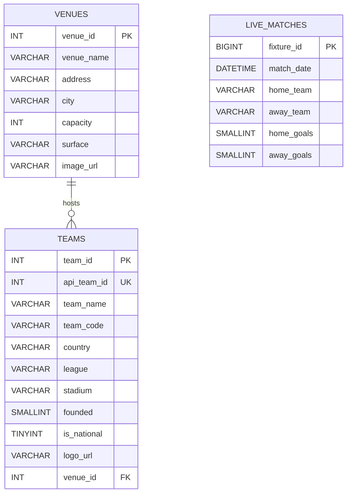

# Data Model

*Last reviewed: 2026-08-21*

## Overview

The Premier League pipeline currently stores data in three MySQL tables:

* `live_matches`
* `teams`
* `venues`

The team and venue tables have a foreign key relationship. The match table currently stores team names and has not yet been connected to the teams table through foreign keys.

## Entity Relationship Diagram



`live_matches` appears separately because it does not yet contain team foreign keys.

## `live_matches`

Stores Premier League fixture dates, team names, and scores.

| Column       | Type                | Null | Description                                                   |
| ------------ | ------------------- | ---- | ------------------------------------------------------------- |
| `fixture_id` | `BIGINT UNSIGNED`   | No   | API-FOOTBALL fixture ID and primary key                       |
| `match_date` | `DATETIME`          | No   | Fixture date and time stored as UTC without a timezone offset |
| `home_team`  | `VARCHAR(100)`      | No   | Home team name                                                |
| `away_team`  | `VARCHAR(100)`      | No   | Away team name                                                |
| `home_goals` | `SMALLINT UNSIGNED` | Yes  | Home score; may be null before a match finishes               |
| `away_goals` | `SMALLINT UNSIGNED` | Yes  | Away score; may be null before a match finishes               |

### Keys and indexes

* Primary key: `fixture_id`
* Unique key: `uq_live_fixture (match_date, home_team, away_team)`
* Index: `idx_live_match_date`
* Index: `idx_live_home_team`
* Index: `idx_live_away_team`

The API fixture ID provides the main duplicate protection.

The date, home team, and away team unique key provides a second safeguard against duplicate fixtures.

### UPSERT behavior

When `fixture_id` already exists, the loader updates:

* Match date
* Home team
* Away team
* Home goals
* Away goals

This allows unfinished fixtures to be updated when scores become available.

## `venues`

Stores stadium information returned with API-FOOTBALL team data.

| Column       | Type           | Null | Description                           |
| ------------ | -------------- | ---- | ------------------------------------- |
| `venue_id`   | `INT UNSIGNED` | No   | API-FOOTBALL venue ID and primary key |
| `venue_name` | `VARCHAR(150)` | No   | Stadium name                          |
| `address`    | `VARCHAR(255)` | Yes  | Street address                        |
| `city`       | `VARCHAR(100)` | Yes  | Stadium city                          |
| `capacity`   | `INT UNSIGNED` | Yes  | Maximum listed capacity               |
| `surface`    | `VARCHAR(50)`  | Yes  | Playing surface                       |
| `image_url`  | `VARCHAR(500)` | Yes  | API image URL                         |

### Keys and indexes

* Primary key: `venue_id`
* Index: `idx_venues_city`

### UPSERT behavior

When `venue_id` already exists, all descriptive venue fields are refreshed from the latest CSV data.

## `teams`

Stores Premier League club identity, metadata, and venue relationships.

| Column        | Type                          | Null | Description                                |
| ------------- | ----------------------------- | ---- | ------------------------------------------ |
| `team_id`     | `INT UNSIGNED AUTO_INCREMENT` | No   | Internal MySQL surrogate primary key       |
| `api_team_id` | `INT UNSIGNED`                | Yes  | Stable API-FOOTBALL team ID                |
| `team_name`   | `VARCHAR(100)`                | No   | Team name                                  |
| `team_code`   | `VARCHAR(20)`                 | Yes  | Short API team code                        |
| `country`     | `VARCHAR(100)`                | Yes  | Team country                               |
| `league`      | `VARCHAR(100)`                | Yes  | Competition name                           |
| `stadium`     | `VARCHAR(150)`                | Yes  | Stadium name stored for convenient display |
| `founded`     | `SMALLINT UNSIGNED`           | Yes  | Founding year                              |
| `is_national` | `TINYINT(1)`                  | No   | `1` for a national team and `0` for a club |
| `logo_url`    | `VARCHAR(500)`                | Yes  | API team logo URL                          |
| `venue_id`    | `INT UNSIGNED`                | Yes  | Foreign key referencing `venues.venue_id`  |

### Keys and indexes

* Primary key: `team_id`
* Unique key: `uq_teams_api_team_id (api_team_id)`
* Unique key: `uq_team_name_league (team_name, league)`
* Index: `idx_teams_venue_id`
* Foreign key: `fk_teams_venue`

### Foreign key behavior

```text
teams.venue_id → venues.venue_id
```

The foreign key uses:

```sql
ON UPDATE CASCADE
ON DELETE SET NULL
```

If a venue ID changes, the related team reference updates automatically.

If a venue is deleted, the team remains in the database and its `venue_id` becomes null.

### UPSERT behavior

When either the API team ID or team-and-league combination already exists, the loader updates the team details rather than inserting a duplicate row.

## Internal and External IDs

The teams table uses two identifiers:

* `team_id` is an internal MySQL-generated surrogate key.
* `api_team_id` is the external identifier assigned by API-FOOTBALL.

Keeping both allows the database to maintain its own stable internal relationships while preserving the source-system identifier for API updates.

The venue and match tables currently use their API identifiers directly as primary keys.

## Load Order

The team and venue loader writes records in this order:

```text
venues
   ↓
teams
```

Venues must exist before teams because the team table contains the foreign key.

The loader validates the relationship before opening the database connection.

## CSV-to-Table Mapping

| CSV file                | MySQL table    | Expected rows |
| ----------------------- | -------------- | ------------: |
| `data/live_matches.csv` | `live_matches` |           380 |
| `data/teams.csv`        | `teams`        |            20 |
| `data/venues.csv`       | `venues`       |            20 |

## Current Record Counts

| Table          | Rows | Unique source IDs |
| -------------- | ---: | ----------------: |
| `live_matches` |  380 |   380 fixture IDs |
| `teams`        |   20 |   20 API team IDs |
| `venues`       |   20 |      20 venue IDs |

All 20 non-null team venue references currently match a row in the venues table.

## Current Normalization Gap

The match table stores `home_team` and `away_team` as text.

This creates several limitations:

* Team names are repeated across fixture rows.
* A team name change must be updated in multiple records.
* The database cannot enforce that every fixture team exists in `teams`.
* Joins depend on exact team-name matching.

The planned normalized design will add:

```text
home_team_id
away_team_id
```

Both columns will reference `teams.team_id`.

The existing team-name columns can then be removed or retained only as source snapshots.

## Migration History

### Migration 001

`001_align_live_matches_schema.sql`:

* Replaced the generated match ID with the API fixture ID
* Changed the fixture ID to `BIGINT UNSIGNED`
* Changed goal columns to `SMALLINT UNSIGNED`
* Added the fixture uniqueness constraint
* Added match-date and team-name indexes

### Migration 002

`002_add_team_and_venue_schema.sql`:

* Added the venues table
* Added API identity and metadata columns to teams
* Added unique team constraints
* Added the team-to-venue foreign key
* Added supporting indexes
